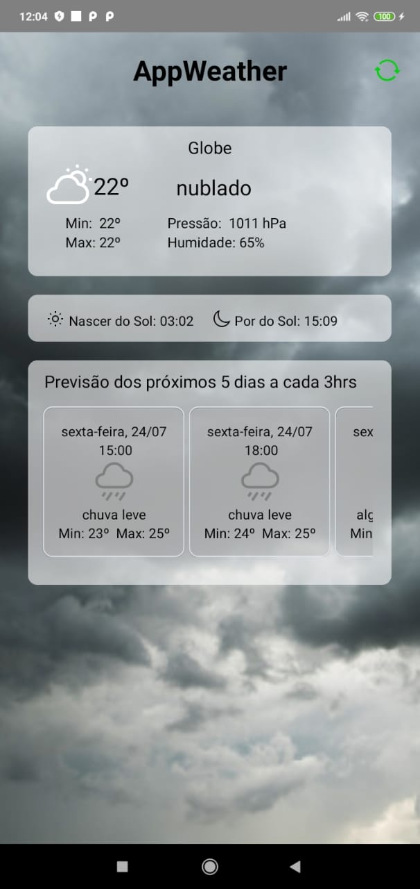
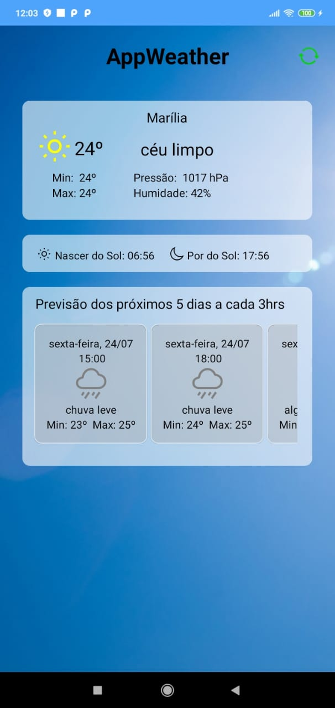

# AppWeather

#### Aplicativo com Geolocalização do usuário trazendo informações climáticas do local que ele se encontra.

## Funcionalidades
- Aplicativo mostra as seguintes informações:
  - Temperatura
  - Temperatura Minima e Máxima
  - Pressão
  - Umidade do ar
  - Horário do Nascer do Sol
  - Horário do Por do Sol
- A imagem de background e ícones variam de acordo com a situação climática Recebida
- Botão atualizar dados no topo da tela
- Lista Horizontal com informações dos próximos 5 dias a cada 3 horas

## Imagens do aplicativo

## Tecnologia
- React Native com TypeScript

## Api Rest
- [OpenWeatherMap](https://openweathermap.org/api)
  - Current Weather Data
  - 5 day / 3 hour Forecast

## Bibliotecas
- react-native-vector-icons
- @react-navigation/native
- react-native-reanimated
- react-native-gesture-handler
- react-native-screens
- react-native-safe-area-context
- @react-native-community/masked-view
- @react-navigation/stack
- axios

